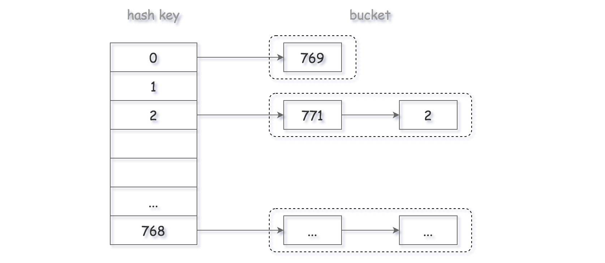
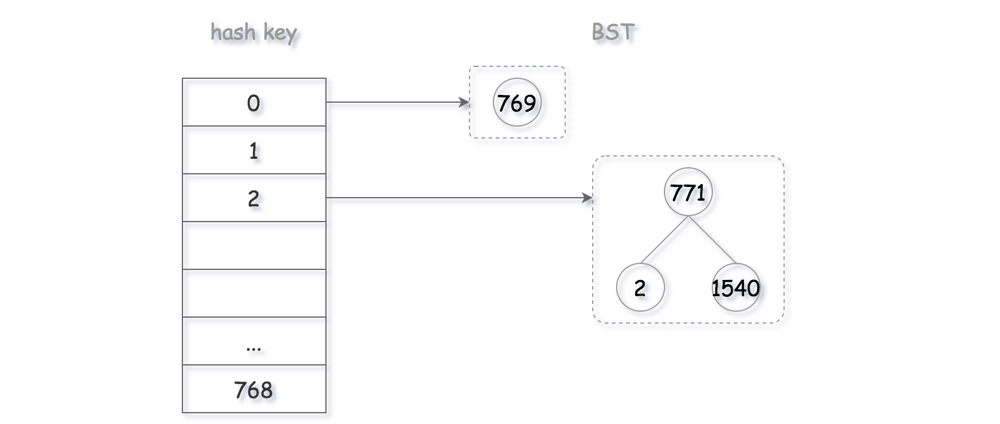

### Array of Doubled Pairs
- https://leetcode.com/problems/array-of-doubled-pairs/
- for each element in array, x, we need to find whether `2*x or x/2` exist. However, if we sort the array based on their abs value, then we need to only check for the existence of `2*x` because, x is the least value and so `x/2` can not exist.
- We might have double or more than occurance of numbers so we want to keep count of values we visited and remove them from the count so we don't use the same value twice. FOr that we need a hashmap of values and their counts.
- The time complexity is `O(NlogN)`. `N` is for creating a hashmap of values and their counts and even though we iterate on the sorted array, we only visit half of it each time because we remove the two visited ones. So if the lenght was 8, next time 6 .... Every time, we're going to look at half of the values and map the rest with its occurances


# Breadth First Search (BFS)

- One common application of Breadth-first Search (BFS) is to find the shortest path from the root node to the target node. BFS of a graph is similar to BFS of a tree. The only catch is, unlike tree, graphs may contain cycles. so we may come to th same node.To avoid processing a node more than once, we use a boolean visited array. 
- https://www.programiz.com/dsa/graph-bfs
- If a node X is added to the queue in the kth round, the length of the shortest path between the root node and X is exactly k. That is to say, you are already in the shortest path the first time you find the target node.
- The time complexity in a graph is O(V+E), where V: number of vertices and E: number of edges.

```py
# BFS algorithm in Python
import collections

def bfs(graph, root):
    queue = collections.deque([root])
    visited = set()
    depth = -1
    
    while queue:
        size = len(queue)
        depth += 1
        
        for _ in range(size):
            cur = queue.popleft()
            if cur in visited: continue
            visited.add(cur)
            queue.extend(nextLayer(node))
        
def nextLayer(node):
    listNodes = []
    // add all successors of node to listNodes
    return listNodes
    
            
if __name__ == '__main__':
    graph = {0: [1, 2], 1: [2], 2: [3], 3: [1, 2]}
    print("Following is Breadth First Traversal: ")
    bfs(graph, 0)
```

## Walls and Gates
- https://leetcode.com/problems/walls-and-gates/
- Instead of searching from an empty room to the gates, we can BFS form all gates at the same time. Since BFS guarantees that we search all rooms of distance `d` before searching rooms of distance `d+1`, the distance to an empty room must be the shortest.

```py
import collections

class Solution:
    def wallsAndGates(self, rooms: List[List[int]]) -> None:
        """
        Do not return anything, modify rooms in-place instead.
        """
        if not rooms:
            return
        
        rows = len(rooms)
        cols = len(rooms[0])
        
        for i in range(rows):
            for j in range(cols):
                if rooms[i][j] == 0:
                    queue = collections.deque([])
                    visited = set()
                    queue.append((i+1, j, 1))
                    queue.append((i-1, j, 1))
                    queue.append((i, j+1, 1))
                    queue.append((i, j-1, 1))
                    
                    while queue:
                        x, y, val = queue.popleft()
                        if x < 0 or x >= rows or y < 0 or y >= cols or (x,y) in visited or rooms[x][y] in [-1, 0]:
                            continue
                            
                        visited.add((x, y))
                        rooms[x][y] = min(rooms[x][y], val)
                        queue.append((x + 1, y, val + 1))
                        queue.append((x - 1, y, val + 1))
                        queue.append((x, y + 1, val + 1))
                        queue.append((x, y - 1, val + 1))
```

## Number of Islands:

- BFS, we search for each island:
```py
def numIslands(grid):
    if not grid:
        return
    
    visited = set()
    queue = collections.deque([])
    rows, cols = len(grid), len(grid[0])
    count = 0
    
    
    for i in range(rows):
        for j in range(cols):
            if grid[i][j] == '1' and (i, j) not in visited:
                count += 1
                queue.append((i,j))
                
                while queue:
                    x, y = queue.popleft()
                    if x < 0 or x >= rows or y < 0 or y >= cols or (x,y) in visited or grid[x][y] != '1':
                        continue
                        
                    visited.add((x,y))
                    queue.append((x + 1, y))
                    queue.append((x - 1, y))
                    queue.append((x, y + 1))
                    queue.append((x, y - 1))
                
                
    return count
```
- https://github.com/SanazME/Algorithm-DataStructure/blob/master/AmazonQuestions.md#5-number-of-islands


## Open the lock
- https://leetcode.com/problems/open-the-lock/
- We can think of the problem as a shortest path on a graph: there are 10,000 nodes (strings `0000` to '9999`) and there is an edge between two nodes if they differ in one digit, and if both nodes are not in `deadends`.

```py
import collections

class Solution:
    def openLock(self, deadends: List[str], target: str) -> int:
        
        queue = collections.deque([('0000', 0)])
        visited = set()
        dead = set(deadends)
        
        def getNeighbors(node):
            output = []
            for i, char in enumerate(node):
                digit = int(char)
                output.append(node[:i] + str((digit + 1) % 10) + node[i+1:])
                output.append(node[:i] + str((digit - 1) % 10) + node[i+1:])
            return output
        
        while queue:
            curr, depth = queue.popleft()
            
            if curr == target:
                return depth
            
            if curr in visited or curr in dead:
                continue
                
            visited.add(curr)
            neighbours = getNeighbors(curr)
            
            for neighbor in neighbours:
                queue.append((neighbor, depth + 1))
                
        return -1
 ```

## Perfect Squares
- https://leetcode.com/problems/perfect-squares/
- We consider an N-ary tree where each node represents a remainder of the number `n` substracting a combination of square numbers. We can use BFS to find the minimal number of square numbers that add up to our original number. To avoid doing the same calculations for the same value of remainder, we use `visited` set.

```py
def numSquares(self, n: int) -> int:
        
    squareNums = [i*i for i in range(1, int(n**0.5) + 1)]
    print(squareNums)

    queue = collections.deque([(n, 0)])
    visited = set()

    while queue:
        curr, depth = queue.popleft()
        if curr == 0:
            return depth

        if curr in visited:
            continue

        visited.add(curr)

        for perfectNum in squareNums:
            if curr < perfectNum:
                break
            else:
                queue.append((curr - perfectNum, depth + 1))
```

## Min Stack
- https://leetcode.com/problems/min-stack/
- Option 1: use a linked list and each node has a min val, we push and pop the head.
```py
class Node:
    def __init__(self, val = None):
        self.val = val
        self.next = None
        self.min = float('Inf')

class MinStack:
    def __init__(self):
        self.head = Node()
        
    def push(self, val):
        curr = self.head
        node = Node(val)
        node.min = min(curr.min, val)
        node.next = curr
        self.head = node
        
    def pop(self):
        curr = self.head
        nextNode = self.head.next
        curr.next = None
        self.head = nextNode
        
        
    def top(self):
        return self.head.val
        
        
    def getMin(self):
        return self.head.min
```
- or having two stacks (lists) for storing the numbers and the other storing the min value so far:
```py
class Stack:
    def __init__(self):
        self._stack = []
        
    def push(self, val):
        self._stack.append(val)
        
        
    def pop(self):
        if self.isEmpty():
            return None
        
        return self._stack.pop()
        
        
    def top(self):
        if self.isEmpty():
            return None
        
        return self._stack[-1]
        
    def isEmpty(self):
        return len(self._stack) == 0
    
    def size(self):
        return len(self._stack)

class MinStack:

    def __init__(self):
        self._mainStack = Stack()
        self._minStack = Stack()
        

    def push(self, val: int) -> None:
        self._mainStack.push(val)
        
        if self._minStack.isEmpty() or self._minStack.top() > val:
            self._minStack.push(val)
        else:
            self._minStack.push(self._minStack.top())
        

    def pop(self) -> None:
        self._mainStack.pop()
        self._minStack.pop()
        

    def top(self) -> int:
        return self._mainStack.top()
        

    def getMin(self) -> int:
        if self._minStack.isEmpty():
            return None
        
        return self._minStack.top()
```

## Valid Parantheses
- https://leetcode.com/problems/valid-parentheses/
```py
class Solution:
    def isValid(self, s: str) -> bool:
        stack = []
        hashMap = {")" : "(", "]" : "[", "}":"{"}
    
        for char in s:
            if char in hashMap:
                if len(stack) == 0:
                    return False

                ele = stack.pop()
                if ele != hashMap[char]:
                    return False

            else:
                stack.append(char)


        return len(stack) == 0
```

## Daily Temperatures
- https://leetcode.com/problems/daily-temperatures/
```py
class Solution:
    def dailyTemperatures(self, temperatures: List[int]) -> List[int]:
        stack = []
        output = [0] * len(temperatures)

        for currentDay, currentTemp in enumerate(temperatures):

            while stack and stack[-1][1] < currentTemp:
                prevDay, _ = stack.pop()
                output[prevDay] = currentDay - prevDay


            stack.append((currentDay, currentTemp))

        return output
```

## Evaluate Reverse Polish Notation
- https://leetcode.com/problems/evaluate-reverse-polish-notation/
```py
class Solution:
    def evalRPN(self, tokens: List[str]) -> int:
        if not tokens:
            return
        
        stack = []
        def add(a, b):
            return a + b
        
        def minus(a, b):
            return a - b
        
        def multiply(a, b):
            return a * b
        
        def division(a, b):
            return int(a / b)
        
        operatorsMap = {"+": add, "-": minus, "*": multiply, "/": division}
        
        for ele in tokens:
            
            if ele in operatorsMap:
                b, a = stack.pop(), stack.pop()
                stack.append(operatorsMap[ele](int(a), int(b)))
                
            else:
                stack.append(ele)
        
        return stack.pop()
```

# Depth First Search (DFS)

- We don't know if the found path is the shortest path between two vertices.
- Instead of queue in BFS, we use stack (LIFO) in DFS.
- The average time complexity for DFS on a graph is O(V + E), where V is the number of vertices and E is the number of edges. In case of DFS on a tree, the time complexity is O(V), where V is the number of nodes.
- We say average time complexity because a set’s `in` operation has an average time complexity of O(1). If we used a list, the complexity would be higher.
- What if you want to find the shortest path?
Hint: Add one more parameter to indicate the shortest path you have already found.

```py
visited = set() # Set to keep track of visited nodes.
def dfs(visited, graph, node):
    if node not in visited:
        print (node)
        visited.add(node)
        for neighbour in graph[node]:
            dfs(visited, graph, neighbour)
```

```py
# DFS algorithm
def dfs(graph, start, visited=None):
    if visited is None:
        visited = set()
    visited.add(start)

    print(start)

    for next in graph[start] - visited:
        dfs(graph, next, visited)
    return visited


graph = {'0': set(['1', '2']),
         '1': set(['0', '3', '4']),
         '2': set(['0']),
         '3': set(['1']),
         '4': set(['2', '3'])}

dfs(graph, '0')
```

## Deep copy of a graph
- https://github.com/SanazME/Algorithm-DataStructure/blob/master/Graph.md#problem-2
```py
"""
# Definition for a Node.
class Node:
    def __init__(self, val = 0, neighbors = None):
        self.val = val
        self.neighbors = neighbors if neighbors is not None else []
"""
import collections

class Solution:
    def cloneGraph(self, node: 'Node') -> 'Node':
        
        if node is None:
            return node

        visited = {}
        return self.dfs(node, visited)


    def dfs(self, node, visited):
        if node in visited:
            return visited[node]


        copyNode = Node(node.val, [])
        visited[node] = copyNode
        for neighbor in node.neighbors:
            copyNode.neighbors.append(self.dfs(neighbor, visited))
            
        return copyNode
```

## Target Sum
- https://github.com/SanazME/Algorithm-DataStructure/blob/master/Graph.md#problem-2-1


## Binary Tree in-order traversal
- https://leetcode.com/problems/binary-tree-inorder-traversal/
1. DFS recursive:
```py
# Definition for a binary tree node.
class TreeNode:
    def __init__(self, val=0, left=None, right=None):
        self.val = val
        self.left = left
        self.right = right

class Solution:
    def inorderTraversal(self, root: TreeNode) -> List[int]:
        return self.helper(root, result=[])
    
    def helper(self, root: TreeNode, result: List[int]) -> List[int]:
        if root is None:
            return result
        
        self.helper(root.left, result)
        result.append(root.val)
        self.helper(root.right, result)
        
        return result
```

2. DFS stack:
```py
def inorderTraversal(self, root: TreeNode) -> List[int]:
    result=[]
    stack = [(root, False)]

    while stack:
        curNode, visited = stack.pop()

        if curNode:
            if visited:
                result.append(curNode.val)
            else:
                stack.append((curNode.right, False))
                stack.append((curNode, True))
                stack.append((curNode.left, False))

    return result
```

## Decode String
- https://leetcode.com/problems/decode-string/
- We can use two stacks to store the freq and the decoded strings. Instead of pushing the decoded string to the stack character by character, we can append all the characters into the string first and then push the entire string into the stack.

Case 1) if the current character is a digit, append it to the number `k`
Case 2) if the current character is a letter, append it to the `currString`
Case 3) if the current character is a `[`, push `k` and `currString` into stacks and reset those variables
Case 4) if the current character is a `]`: We must begin decoding:
    - We must decode the currentString. Pop `currentK` from the `countStack` and decode the pattern `currentK[currentString]`
    - As the stringStack contains the previously decoded string, pop the `decodedString` from the `stringStack`. Update the `decodedString = decodedString + currentK[currentString]`
```py
class Solution:
    def decodeString(self, s: str) -> str:
        numStack = []
        strStack = []
        
        freq = 0
        currString = ''
        
        for char in s:
            if char.isnumeric():
                freq = freq * 10 + (ord(char) - ord('0'))
                
            elif char.isalpha():
                currString = currString + char
                
            elif char == '[':
                numStack.append(freq)
                strStack.append(currString)
                
                freq = 0
                currString = ''
                
            else:
                decodedString = strStack.pop()
                
                tmp = ''
                for _ in range(numStack.pop()):
                    tmp += currString
                
                decodedString += tmp
                currString = decodedString
                
        return currString
```
- **Time complexity** `O(maxK * n)`, `maxK`: max value of `k` and `n`:  size of string
- **Space complexity** `O(l + m)`, `l`: number of letters, `m`: number of digits

## Flood fill
- https://leetcode.com/problems/flood-fill/

```py
class Solution:
    def floodFill(self, image: List[List[int]], sr: int, sc: int, color: int) -> List[List[int]]:
        
        
        
        def dfs(i, j, origColor, visited):
            if i < 0 or i >= len(image) or j < 0 or j >= len(image[0]) or image[i][j] not in [origColor] or (i,j) in visited:
                return
            
            
            visited.add((i,j))
            image[i][j] = color
            dfs(i + 1, j, origColor, visited)
            dfs(i - 1, j, origColor, visited)
            dfs(i, j + 1, origColor, visited)
            dfs(i, j - 1, origColor, visited)
        
        
        dfs(sr, sc, image[sr][sc], set())
        
        return image```


# DFS with stack:
- Given the root of a binary tree and an integer targetSum, return true if the tree has a root-to-leaf path such that adding up all the values along the path equals targetSum.

**DFS with Stack**
```py
def hasPathSum(root, targetSum):
    if not root:
        return False

    sumSofar = root.val
    stack = [(root, 0)]

    while stack:
        print([(node.val, sumAll) for node, sumAll in stack])
        node, localSum = stack.pop()

        currentSum = node.val + localSum

        if not(node.left or node.right):
            if currentSum == targetSum:
                return True

        else:
            if node.left: stack.append((node.left, currentSum))
            if node.right: stack.append((node.right, currentSum))
                
    return False
```
```py
# 1. DFS with stack 2
def hasPathSum(root, targetSum):
    if not root:
        return False
        
    stack = [(root, root.val)]
    
    while stack:
        node, val = stack.pop()
        
        if val == targetSum and not(node.left or node.right):
            return True
            
        if node.left: stack.append((node.left, val + node.left.val))
        if node.right: stack.append((node.right, val + node.right.val))
    return False
```

**Recursive**
```py
def hasPathSum(root, targetSum):
    if not root:
        return False
        
    if root.val == targetSum and not(root.left, root.right):
        return True
        
    return hasPathSum(root.left, targetSum - root.val) or hasPathSum(root.right, targetSum - root.val)
```
**BFS with queue**
```py
def hasPathSum(root, targetSum):
    if not root:
        return False
        
    queue = [(root, targetSum - root.val)]
    
    while queue:
        curr, val = queue.popleft()
        if val == 0 and not(curr.left or curr.right):
            return True
        if curr.left: queue.append((curr.left, val - curr.left.val))
        if curr.right: queue.append((curr.right, val - curr.right.val))
    return False

```

### Path Sum II: https://leetcode.com/problems/path-sum-ii/
**DFS with stack**
```py
def pathSum(self, root, targetSum):
        """
        :type root: TreeNode
        :type targetSum: int
        :rtype: List[List[int]]
        """
        result = []
        if not root:
            return result

        stack = [(root, 0, [])]


        while stack:
            node, localSum, branchList = stack.pop()
            localSum += node.val

            if localSum == targetSum and not(node.left or node.right):
                result.append(branchList + [node.val])

            else:
                if node.right:
                    stack.append((node.right, localSum, branchList + [node.val]))
                if node.left:
                    stack.append((node.left, localSum, branchList + [node.val]))

        return result
```
```py
def pathSum(self, root, targetSum):
        """
        :type root: TreeNode
        :type targetSum: int
        :rtype: List[List[int]]
        """
        result = []
        if not root:
            return result
        
        stack = [(root, targetSum, [root.val])]      
        
        while stack:
            node, sumNodes, branchResult = stack.pop()
                  
            # reaching a leaf node
            if not(node.left or node.right) and node.val == sumNodes:
                result.append(branchResult)    
                
            if node.left: stack.append((node.left, sumNodes - node.val, branchResult+ [node.left.val]))
            if node.right: stack.append((node.right, sumNodes - node.val, branchResult+[node.right.val]))

        return result

```
**Recursive DFS**
```py
def pathSum(self, root, targetSum):
        """
        :type root: TreeNode
        :type targetSum: int
        :rtype: List[List[int]]
        """
        return helper(root, targetSum, [], [])
    
def helper(node, targetSum, branchList, result):
    if node == None:
        return []
    
    if node.val == targetSum and not(node.left or node.right):
        newBranch = branchList + [node.val]
        result.append(newBranch)
        
    if node.left: helper(node.left, targetSum - node.val, branchList + [node.val], result) 
    if node.right: helper(node.right, targetSum - node.val, branchList + [node.val], result)
    
    return result
```
```py
def pathSum(self, root, targetSum):
        """
        :type root: TreeNode
        :type targetSum: int
        :rtype: List[List[int]]
        """
        # Recursive DFS
        if not root:
            return []
        result = []
        self.dfs(root, targetSum, [root.val], result)
        return result
    
    def dfs(self, node, sumNodes, branchResult, result):
        
        if not(node.left or node.right) and sumNodes == node.val:
            result.append(branchResult)
            
        if node.left: self.dfs(node.left, sumNodes - node.val, branchResult + [node.left.val], result)     
        if node.right: self.dfs(node.right, sumNodes - node.val,  branchResult + [node.right.val], result)

```


## Given n non-negative integers representing an elevation map where the width of each bar is 1, compute how much water it is able to trap after raining.
# Example:
# Input: [0,1,0,2,1,0,1,3,2,1,2,1]
# Output: 6

- The brute force solution: for each location, find the max on the left and max on the right of that location and take the min of them
- Optimal solution: calculate the column of water in each location based on the followings:
    - If there was an infinite tall wall on the right end of the array, the water in each location would be the height of max so far on the left of the location - height of the location
    - Now for the locations on the right of the infinite wall, the water in each location coming from right to left is heigth of max so far on the right of the location - height of location.

```py
def trap(self, height):
    """
    :type height: List[int]
    :rtype: int
    """
    size = len(height)
    area = 0

    if size == 0:
        return area

    globalIdx, globalMax = self.findGlobalMax(height)

    # water trap values coming from left to right: find the local max on the left side and calculate the trapped water = (local_max - current_height)*width(=1)
    max_height_local = height[0]
    for i in range(0, globalIdx):
        if height[i] > max_height_local:
            max_height_local = height[i]

        area += (max_height_local - height[i]) * 1

    # water trap values coming from right to left: find the local max on the right side and calculate trapped water = (local_max - current_height)*width
    max_height_local = height[-1]
    for i in range(size - 1, globalIdx, -1):
        if height[i] > max_height_local:
            max_height_local = height[i]
        area += (max_height_local - height[i]) * 1

    return area

def findGlobalMax(self, height):
    maxIdx, maxHeight = 0, height[0]

    for i, val in enumerate(height):
        if val > maxHeight:
            maxIdx = i
            maxHeight = val
    return (maxIdx, maxHeight)
 ```

## Longest consecutive sequence:
- https://leetcode.com/problems/longest-consecutive-sequence/
- **solutions:**
- **1. Brute force**:
- it just considers each number in nums, attempting to count as high as possible from that number using only numbers in nums. After it counts too high (i.e. currentNum refers to a number that nums does not contain), it records the length of the sequence if it is larger than the current best. The algorithm is necessarily optimal because it explores every possibility.
```py
def longestConsecutive(nums):
    if not nums:
        return 0

    longest = 0
    for num in nums:
        curr = num
        local_streak = 1
        
        while curr + 1 in nums:
            local_streak += 1
            curr += 1
        
        longest = max(longest, local_streak)
    return longest
```
- **Time complexity**: O(n^3) - the for loop: n, the while loop is n and the `in` operator in `while` is O(n)..
- **Space complexity** O(1).

**2. Define nums as a set so we do lookup in in O(1) time:**
- First turn the input into a set of numbers. That takes O(n) and then we can ask in O(1) whether we have a certain number. Then go through the numbers. If the number x is the start of a streak (i.e., x-1 is not in the set), then test y = x+1, x+2, x+3, ... and stop at the first number y not in the set. The length of the streak is then simply y-x and we update our global best with that. Since we check each streak only once, this is overall **O(n)**.
```py
def longestConsecutive(self, nums):
        """
        :type nums: List[int]
        :rtype: int
        """
        nums = set(nums)
        result = 0
        
        for x in nums:
            if x - 1 not in nums:
                y = x + 1
                while y in nums:
                    y += 1
                result = max(result, y - x)
        return result
```
## 
data structure (min heap, max heap and Priority Queue): 
- Look at readme in tree: https://github.com/SanazME/Algorithm-DataStructure/blob/master/trees/README.md#tree
- https://www.youtube.com/watch?v=HqPJF2L5h9U
- https://www.programiz.com/dsa/priority-queue
- Python heap: `heappush, heappop...` for min heap

## Spiral Array
- https://leetcode.com/problems/spiral-matrix/

```py
class Solution:
    def spiralOrder(self, matrix: List[List[int]]) -> List[int]:
        rows = len(matrix)
        cols = len(matrix[0])
        
        output = []
        
        minRow = minCol = 0
        maxRow = rows - 1
        maxCol = cols - 1
        
        while len(output) < rows * cols:
            
            if minRow <= maxRow and minCol <= maxCol:
                i = minRow
                for j in range(minCol, maxCol + 1):
                    output.append(matrix[i][j])
                minRow += 1

                # if minRow > maxRow:
                #     break

            if minRow <= maxRow and minCol <= maxCol:
                j = maxCol
                for i in range(minRow, maxRow + 1):
                    output.append(matrix[i][j])
                maxCol -= 1

                # if minCol > maxCol:
                #     break

            if minRow <= maxRow and minCol <= maxCol:
                i = maxRow
                for j in range(maxCol, minCol - 1, -1):
                    output.append(matrix[i][j])
                maxRow -= 1

                # if minRow > maxRow:
                #     break

            if minRow <= maxRow and minCol <= maxCol:
                j = minCol
                for i in range(maxRow, minRow - 1, -1):
                    output.append(matrix[i][j])
                minCol += 1

                # if minCol > maxCol:
                #     break
            
        
        return output
```
## Pascal Triangle
- https://leetcode.com/problems/pascals-triangle/

- our output list will store each row as a sublist
- the first and last element of each sublist is 1.
- we then can calculate each element in between based on pervious sublist elements
```py
def generate(numRows):
    triangle = [[1]]
    
    if numRows > 1:
        for row in range(1, numRows):
            sublist = [0] * (row + 1)
            sublist[0] = sublist[-1] = 1
            
            for k in range(1, row):
                sublist[k] = triangle[row - 1][k] + triangle[row - 1][k - 1]
            
            triangle.append(sublist)

    
    return triangle
```

## Minimum Size Subarray Sum
- https://leetcode.com/problems/minimum-size-subarray-sum/
**Algorithm**
1. Initialize `left` pointer to 0
2. Iterate over the array:
    - Add to the sum
    - while sum is larger than the target:
        - update the answer
        - remove from the sum index....
```py
def minSubarray(nums, target):
    maxVal = max(nums)
    if maxVal >= target:
        return 1
    
    if len(nums) == 0:
        return 0
    
    left = 0
    sumSoFar = 0
    countSoFar = 0
    minCount = float('Inf')
    
    for i in range(len(nums)):
        sumSoFar += nums[i]
        while sumSoFar >= target:
            minCount = min(minCount, i - left + 1)
            sumSoFar -= nums[left]
            left += 1
            
    if minCount != float('Inf'):
        return minCount
    else:
        return 0
```
## Rotate Array
- https://leetcode.com/problems/rotate-array

**Solution 1**:
with extra space
```py
class Solution:
    def rotate(self, nums: List[int], k: int) -> None:
        """
        Do not return anything, modify nums in-place instead.
        """
        k = k % len(nums)
        if k == 0 or len(nums) == 0:
            return nums
        
        output = [0] * len(nums)
        
        for i in range(len(nums)):
            output[(i + k) % len(nums)] = nums[i]
            
        nums[:] = output
```

without extra space and chaning in-place:
We can directly place every number of the array at its required correct position. But if we do that, we will destroy the original element. Thus, we need to store the number being replaced in a `temp` variable. Then, we can place the replaced number `temp` at its correct position and so on, n times, where n is the length of array. We have chosen nn to be the number of replacements since we have to shift all the elements of the array(which is n).
But, there could be a problem with this method, if `n % k = 0` where `k = k % n` (since a value of k larger than n eventually leads to a k equivalent to `k % n`). In this case, while picking up numbers to be placed at the correct position, we will eventually reach the number from which we originally started. Thus, in such a case, when we hit the original number's index again, we start the same process with the number following it.

Now let's look at the proof of how the above method works. Suppose, we have n as the number of elements in the array and k is the number of shifts required. Further, assume `n %k = 0`. Now, when we start placing the elements at their correct position, in the first cycle all the numbers with their index i satisfying `i % k = 0` get placed at their required position. This happens because when we jump k steps every time, we will only hit the numbers k steps apart. We start with index `i = 0`, having `i % k = 0`. Thus, we hit all the numbers satisfying the above condition in the first cycle. When we reach back the original index, we have placed `n/k` elements at their correct position, since we hit only that many elements in the first cycle. Now, we increment the index for replacing the numbers. This time, we place other `n/k` elements at their correct position, different from the ones placed correctly in the first cycle, because this time we hit all the numbers satisfy the condition `i % k = 1`. 
When we hit the starting number again, we increment the index and repeat the same process from `i = 1` for all the indices satisfying `i % k == 1`. This happens till we reach the number with the index `i % k = 0` again, which occurs for `i=k`. We will reach such a number after a total of k cycles. Now, the total count of numbers exclusive numbers placed at their correct position will be `k * n/k = n`. Thus, all the numbers will be placed at their correct position.
```py
class Solution:
    def rotate(self, nums: List[int], k: int) -> None:
        n = len(nums)
        k %= n
        
        start = count = 0
        while count < n:
            current, prev = start, nums[start]
            while True:
                next_idx = (current + k) % n
                nums[next_idx], prev = prev, nums[next_idx]
                current = next_idx
                count += 1
                
                if start == current:
                    break
            start += 1
```

## Design a circular queue
- A more efficient way is to use a circular queue. Specifically, we may use a fixed-size array and two pointers to indicate the starting position and the ending position. And the goal is to reuse the wasted storage we mentioned previously.
- https://leetcode.com/explore/learn/card/queue-stack/228/first-in-first-out-data-structure/1396/
- Create a circular queue with enQueue, deQueue, Front and Rear methods and any other methods that is needed.

```py
class MyCircularQueue:
    def __init__(self, size):
        self.size = size
        self.head = -1
        self.tail = -1
        self.count = 0
        self.arr = [None] * self.size
        
        
    def enQueue(self, val):
        if self.isFull():
            return False
        
        # move tail index one unit forward
        if self.head == -1:
            self.head, self.tail = 0, 0
        
        else:
            self.tail = (self.tail + 1) % self.size
        
        self.arr[self.tail] = val     
        self.count += 1
                
        return True
            
        
    def deQueue(self):
        if self.isEmpty():
            return False
        
        
        self.head = (self.head + 1) % self.size
        self.count -= 1

        return True
        
        
    
    def isFull(self):
        if self.count == self.size:
            return True
        return False
        
    def isEmpty(self):
        return self.count == 0
    
    def Front(self):
        if self.isEmpty():
            return -1
        return self.arr[self.head]
        
    def Rear(self):
        if self.isEmpty():
            return -1
        return self.arr[self.tail]
```

OR with only one `head` pointer and deducing `tail` index from `head` and `count`:
```py
class MyCircularQueue:
    def __init__(self, k):
        self.capacity = k
        self.head = 0
        self.count = 0
        self.queue = [None] * self.capacity
    
    def enQueue(self, val):
        if self.isFull():
            return False
        
        # move tail index one unit forward
        self.queue[(self.head + self.count) % self.capacity] = val
        self.count += 1
                
        return True
            
    def deQueue(self):
        if self.isEmpty():
            return False
        
        self.head = (self.head + 1) % self.capacity
        self.count -= 1

        return True
    
    def isFull(self):
        return self.count == self.capacity
            
    def isEmpty(self):
        return self.count == 0
    
    def Front(self):
        if self.isEmpty():
            return -1
        return self.queue[self.head]
        
    def Rear(self):
        if self.isEmpty():
            return -1
        return self.queue[(self.head + self.count - 1) % self.capacity]
```
- This solution is not thread safe and there can be a race condition for incrementing the counter among different threads. To implement a safe thread solution, we need to use lock(). For example for enQueue method:
```py
from threading import Lock

class MyCircularQueue:
    def __init__(self, k):
        self.capacity = k
        self.head = 0
        self.count = 0
        self.queue = [None] * self.capacity
        self.queueLock = Lock()
    
        
        
    def enQueue(self, val):
        
        with self.queueLock:
            if self.isFull():
                return False

            # move tail index one unit forward
            self.queue[(self.head + self.count) % self.capacity] = val
            self.count += 1
                
        return True
            
        
    def deQueue(self):
        
        with self.queueLock:
            if self.isEmpty():
                return False


            self.head = (self.head + 1) % self.capacity
            self.count -= 1

        return True
        
        
    
    def isFull(self):
        return self.count == self.capacity
            
    def isEmpty(self):
        return self.count == 0
    
    def Front(self):
        if self.isEmpty():
            return -1
        return self.queue[self.head]
        
    def Rear(self):
        if self.isEmpty():
            return -1
        return self.queue[(self.head + self.count - 1) % self.capacity]
```

## Moving Average from Data stream
- https://leetcode.com/problems/moving-average-from-data-stream/
- We can use an array with ever growing in size as the stream of data is coming:

```py
class MovingAverage:

    def __init__(self, size: int):
        self.size = size
        self.count = 0
        self.arr = []
        self.start = 0
        self.sumWindow = 0
        

    def next(self, val: int) -> float:
        if self.count < self.size:
            self.sumWindow += val
            self.arr.append(val)
            self.count += 1
        else:
            self.arr.append(val)
            self.sumWindow -= self.arr[self.start]
            self.sumWindow += val
            self.start += 1

        return (self.sumWindow * 1.0) / self.count
```
- The better approach is to use **circular queue** so that the space complexity is `O(N)` ( size of window) and time complexity is `O(1)`:
```py
class MovingAverage:

    def __init__(self, size: int):
        self.size = size
        self.count = 0
        self.queue = [0] * self.size
        self.head = 0
        self.sumWindow = 0
        

    def next(self, val: int) -> float:
        
        idx = (self.head + self.count) % self.size
        
        if self.count < self.size:
            self.count += 1
        else:
            self.sumWindow -= self.queue[idx]
            self.head = (self.head + 1) % self.size
            
        self.queue[idx] = val
        self.sumWindow += val

        return (self.sumWindow * 1.0) / self.count
```

## 1. Subtree of Another Tree
- https://leetcode.com/problems/subtree-of-another-tree/description/

### Solution 1: DFS
- Let's consider the most naive approach first. We can traverse the tree rooted at root (using Depth First Search) and for each node in the tree, check if the "tree rooted at that node" is identical to the "tree rooted at subRoot". If we find such a node, we can return true. If traversing the entire tree rooted at root doesn't yield any such node, we can return false.

Since we have to check for identicality, again and again, we can write a function isIdentical which takes two roots of two trees and returns true if the trees are identical and false otherwise.

Checking the identicality of two trees is a classical task. We can use the same approach as the one in Same Tree Problem. We can traverse both trees simultaneously and

   - if any of the two nodes being checked is null, then for trees to be identical, both the nodes should be null. Otherwise, the trees are not identical.
   - if both nodes are non-empty. Then for the tree to be identical, ensure that:
        - values of the nodes are the same
        - left subtrees are identical
        - right subtrees are identical

```py
# Definition for a binary tree node.
# class TreeNode(object):
#     def __init__(self, val=0, left=None, right=None):
#         self.val = val
#         self.left = left
#         self.right = right
class Solution(object):
    def isSubtree(self, root, subRoot):
        """
        :type root: TreeNode
        :type subRoot: TreeNode
        :rtype: bool
        """
        
        if self.isIdentical(root, subRoot): return True

        if root == None:
            return False

        return self.isSubtree(root.left, subRoot) or self.isSubtree(root.right, subRoot)

        
    def isIdentical(self, subtree1, subtree2):
        if subtree1 == None or subtree2 == None:
            return subtree1 == subtree2 == None

        return (subtree1.val == subtree2.val and 
        self.isIdentical(subtree1.left, subtree2.left) and
        self.isIdentical(subtree1.right, subtree2.right))
```

**Time complexity**:
- `O(M * N)`. For every `N` node in the tree, we check if the tree rooted at node is identical to subRoot. This check takes `O(M)` time, where `M` is the number of nodes in subRoot. Hence, the overall time complexity is `O(M * N)`.

**Space complexity**
- There will be at most `N` recursive call to dfs ( or isSubtree). Now, each of these calls will have `M` recursive calls to isIdentical. Before calling isIdentical, our call stack has at most `O(N)` elements and might increase to `O(N + M)` during the call. After calling isIdentical, it will be back to at most `O(N)` since all elements made by isIdentical are popped out. Hence, the maximum number of elements in the call stack will be `M+N`.

### Solution 2: Hash Table
- It turns out that tree comparison is expensive. In the very first approach, we need to perform the comparison for at most `N` nodes, and each comparison cost `O(M)`. If we can somehow reduce the cost of comparison, then we can reduce the overall time complexity

You may recall that the cost of comparison of two integers is constant. As a result, if we can somehow transform the subtree rooted at each node to a unique integer, then we can compare two trees in constant time.

_Is there any way to transform a tree into an integer?
Yes, there is. We can use the concept of Hashing.
_
We want to hash (map) each subtree to a unique value. We want to do this in such a way that if two trees are identical, then their hash values are equal. And, if two trees are not identical, then their hash values are not equal. This hashing can be used to compare two trees in `O(1)` time.

We will build the hash of each node depending on the hash of its left and right child. The hash of the root node will represent the hash of the whole tree because to build the hash of the root node, we used (directly, or indirectly) the hash values of all the nodes in its subtree.

If any node in "tree rooted at root" has hash value equal to the hash value of "tree rooted at subRoot", then "tree rooted at subRoot" is a subtree of "tree rooted at root", provided our hashing mechanism maps nodes to unique values.

There can be multiple ways of hashing the tree. We want to use that mechanism which is

 - Simple to calculate
- Efficient
- Has minimum spurious hits
Spurious Hits: If hash values of two trees are equal, and still they are not identical, then we call it a spurious hit. A spurious hit is a case of False Positive.

One can use any hashing function which guarantees minimum spurious hits and is calculated in `O(1)` time. We will use the following hashing function.

- If it's a null node, then hash it to 3. (We can use any prime number here)
- Else,
    - left shift the hash value of the left node by some fixed value.
    - left shift hash value of right node by 1
    - add these shifted values with this `node->val` to get the hash of this node.

**Please note that one should avoid concatenating strings for hash value purposes because it will take `O(N)` time to concatenate strings.**

To ensure minimum spurious hits, we can map each node to two hash values, thus getting one hash pair for each node. Trees rooted at s and Tree rooted at t will have the same hash pair iff they are identical, provided our hashing technique maps nodes to unique hash pairs.

One can read more about this in Editorial of 28. Find the Index of the First Occurrence of a String in Another String.

```py
class Solution:
    def isSubtree(self, root: TreeNode, subRoot: TreeNode) -> bool:

        MOD_1 = 1_000_000_007
        MOD_2 = 2_147_483_647

        def hash_subtree_at_node(node, need_to_add):
            if node is None:
                return (3, 7)

            left = hash_subtree_at_node(node.left, need_to_add)
            right = hash_subtree_at_node(node.right, need_to_add)

            left_1 = (left[0] << 5) % MOD_1
            right_1 = (right[0] << 1) % MOD_1
            left_2 = (left[1] << 7) % MOD_2
            right_2 = (right[1] << 1) % MOD_2

            hashpair = ((left_1 + right_1 + node.val) % MOD_1,
                        (left_2 + right_2 + node.val) % MOD_2)

            if need_to_add:
                memo.add(hashpair)

            return hashpair

        # List to store hashed value of each node.
        memo = set()

        # Calling and adding hash to List
        hash_subtree_at_node(root, True)

        # Storing hashed value of subRoot for comparison
        s = hash_subtree_at_node(subRoot, False)

        # Check if hash of subRoot is present in memo
        return s in memo
```

**Time Complexity** `O(M+N)`:
We are traversing the tree rooted at root in `O(N)` time. We are also traversing the tree rooted at subRoot in `O(M)` time. For each node, we are doing constant time operations. After traversing, for lookup we are either doing `O(1)` operations, or `O(N)` operations. Hence, the overall time complexity is `O(N+M)`

**Space Complexity** `O(M+N)`:
We are using memo to store the hash pair of each node in the tree rooted at root. Hence, for this, we need `O(N)` space.
Moreover, since we are using recursion, the space required for the recursion stack will be `O(N)` for `hashSubtreeAtNode(root, true)` and `O(M)` for `hashSubtreeAtNode(subRoot, false)`.
Hence, overall space complexity is` O(M+N)`.

## 2. Kth Largest Element in a Stream
- https://leetcode.com/problems/kth-largest-element-in-a-stream/description/
```py
from heapq import *

class KthLargest:
    def __init__(self, k: int, nums: List[int]):
        self.k = k
        self.heap = nums
        heapq.heapify(self.heap)
        
        while len(self.heap) > k:
            heapq.heappop(self.heap)

    def add(self, val: int) -> int:
        heapq.heappush(self.heap, val)
        if len(self.heap) > self.k:
            heapq.heappop(self.heap)
        return self.heap[0]
```

**Time Complexity**
Given `N` as the length of nums and `M` as the number of calls to add(),
- https://www.youtube.com/watch?v=HqPJF2L5h9U

**Time complexity**: 1O(N⋅log⁡(N)+M⋅log⁡(k))`

The time complexity is split into two parts. 
- First, the constructor needs to turn nums into a heap of size `k`. **In Python, `heapq.heapify()` can turn nums into a heap in `O(N)` time**. Then, we need to remove from the heap until there are only `k` elements in it, which means removing `N - k` elements. Since k can be, say 1, in terms of big O this is `N` operations, with each operation costing `log⁡(N)`. Therefore, the constructor costs `O(N+N⋅log⁡(N))=O(N⋅log⁡(N))`.
    - Push into a heap (sift down):  `O(log N)`, sift down: height of the heap (complete binary tree) which is `log N`
    - Pop (and sift up): `O(log N)`, sift up: height of the heap (complete binary tree) which is `log N`

- Next, every call to add() involves adding an element to heap and potentially removing an element from heap. Since our heap is of size k, every call to add() at worst costs O(2∗log⁡(k))=O(log⁡(k))O(2 * \log(k)) = O(\log(k))O(2∗log(k))=O(log(k)). That means M calls to add() costs `O(M⋅log⁡(k))`.

**Space complexity:** `O(N)`


## 3. Design a HashSet
- https://leetcode.com/problems/design-hashset/

**hash function:** the goal of the hash function is to assign an address to store a given value. Ideally, each unique value should have a unique hash value.

**collision handling:** since the nature of a hash function is to map a value from a space A into a corresponding value in a smaller space B, it could happen that multiple values from space A might be mapped to the same value in space B. This is what we call collision. Therefore, it is indispensable for us to have a strategy to handle the collision.

Overall, there are several strategies to resolve the collisions:
- **Separate Chaining:** for values with the same hash key, we keep them in a bucket, and each bucket is independent of each other.

- **Open Addressing:** whenever there is a collision, we keep on probing on the main space with certain strategy until a free slot is found.

- **2-Choice Hashing:** we use two hash functions rather than one, and we pick the generated address with fewer collision

we focus on the strategy of **separate chaining**. Here is how it works overall.

- Essentially, the primary storage underneath a HashSet is a continuous memory as Array. Each element in this array corresponds to a bucket that stores the actual values.

- Given a value, first we generate a key for the value via the hash function. The generated key serves as the index to locate the bucket.

- Once the bucket is located, we then perform the desired operations on the bucket, such as add, remove and contains.

### Approach 1: LinkedList as Bucket
The common choice of hash function is the `modulo` operator, i.e. `hash=value mod  base`. Here, the `base` of modulo operation would determine the number of buckets that we would have at the end in the HashSet. it is generally advisable to use a prime number as the base of modulo, e.g. `769`, in order to reduce the potential collisions.



As to the design of bucket, again there are several options. One could simply use another Array as bucket to store all the values. However, one drawback with the Array data structure is that it would take `O(N)` time complexity to remove or insert an element, rather than the desired `O(1)`.

Since for any update operation, we would need to scan the entire bucket first to avoid any duplicate, a better choice for the implementation of bucket would be the LinkedList, which has a **constant time complexity for the insertion as well as deletion, once we locate the position to update.**

```py

class MyHashSet(object):

    def __init__(self):
        """
        Initialize your data structure here.
        """
        self.keyRange = 769
        self.bucketArray = [Bucket() for i in range(self.keyRange)]

    def _hash(self, key):
        return key % self.keyRange

    def add(self, key):
        """
        :type key: int
        :rtype: None
        """
        bucketIndex = self._hash(key)
        self.bucketArray[bucketIndex].insert(key)

    def remove(self, key):
        """
        :type key: int
        :rtype: None
        """
        bucketIndex = self._hash(key)
        self.bucketArray[bucketIndex].delete(key)

    def contains(self, key):
        """
        Returns true if this set contains the specified element
        :type key: int
        :rtype: bool
        """
        bucketIndex = self._hash(key)
        return self.bucketArray[bucketIndex].exists(key)


class Node:
    def __init__(self, value, nextNode=None):
        self.value = value
        self.next = nextNode

class Bucket:
    def __init__(self):
        # a pseudo head
        self.head = Node(0)

    def insert(self, newValue):
        # if not existed, add the new element to the head.
        if not self.exists(newValue):
            newNode = Node(newValue, self.head.next)
            # set the new head.
            self.head.next = newNode

    def delete(self, value):
        prev = self.head
        curr = self.head.next
        while curr is not None:
            if curr.value == value:
                # remove the current node
                prev.next = curr.next
                return
            prev = curr
            curr = curr.next

    def exists(self, value):
        curr = self.head.next
        while curr is not None:
            if curr.value == value:
                # value existed already, do nothing
                return True
            curr = curr.next
        return False


# Your MyHashSet object will be instantiated and called as such:
# obj = MyHashSet()
# obj.add(key)
# obj.remove(key)
# param_3 = obj.contains(key)
```

**Time Complexity**
- `O(N/K)` where `N` is the number of all possible values and `K` is the number of predefined buckets which 769
    - assuming that the values are evenly distributed, we could consider the average size of a bucket is `N/K`
    - Since for each operation, in the worst case, we would need to scan the entire bucket, the time complexity is `O(N/K)`

**Space Complexity**
- `O(K + M)` where `K` is the number of predefined buckets and `M` is the number of unique values that have been inserted into the HashSet.

### Approach 2: Binary Search Tree
In the above approach, one of the drawbacks is that we have to scan the entire linkedlist in order to verify if a value already exists in the bucket (i.e. the lookup operation).

To optimize the above process, one of the strategies could be that we maintain a **sorted list as the bucket**. With the sorted list, we could obtain the `O(log⁡N)` time complexity for the lookup operation, with the binary search algorithm, rather than a linear `O(N)` complexity as in the above approach.

On the other hand, if we implement the sorted list in a continuous space such as Array, it would incur a linear time complexity for the update operations (e.g. insert and delete), since we would need to shift the elements.

_So the question is can we have a data structure that have `O(log⁡N)` time complexity, for the operations of search, insert and delete ?_
The answer is yes, with **Binary Search Tree (BST)**. Thanks to the properties of BST, we could optimize the time complexity of our first approach with LinkedList.


One could build upon the implementation of first approach for our second approach, by applying the Façade design pattern.

_We have already defined a façade class (i.e. bucket) with three interfaces (exists, insert and delete), which hides all the underlying details from its users (i.e. HashSet)._

So we can keep the bulk of the code, and simply modify the implementation of bucket class with BST. 

First solve the following for BST:
- [Search in BST](https://leetcode.com/articles/search-in-a-bst/)
- [Insert in BST](https://leetcode.com/articles/insert-into-a-bst/)
- [Delete in BST](https://leetcode.com/articles/delete-node-in-a-bst)

```py
class MyHashSet:

    def __init__(self):
        """
        Initialize your data structure here.
        """
        self.keyRange = 769
        self.bucketArray = [Bucket() for i in range(self.keyRange)]

    def _hash(self, key) -> int:
        return key % self.keyRange

    def add(self, key: int) -> None:
        bucketIndex = self._hash(key)
        self.bucketArray[bucketIndex].insert(key)

    def remove(self, key: int) -> None:
        """
        :type key: int
        :rtype: None
        """
        bucketIndex = self._hash(key)
        self.bucketArray[bucketIndex].delete(key)

    def contains(self, key: int) -> bool:
        """
        Returns true if this set contains the specified element
        :type key: int
        :rtype: bool
        """
        bucketIndex = self._hash(key)
        return self.bucketArray[bucketIndex].exists(key)

class Bucket:
    def __init__(self):
        self.tree = BSTree()

    def insert(self, value):
        self.tree.root = self.tree.insertIntoBST(self.tree.root, value)

    def delete(self, value):
        self.tree.root = self.tree.deleteNode(self.tree.root, value)

    def exists(self, value):
        return (self.tree.searchBST(self.tree.root, value) is not None)

class TreeNode:
    def __init__(self, value):
        self.val = value
        self.left = None
        self.right = None

class BSTree:
    def __init__(self):
        self.root = None

    def searchBST(self, root: TreeNode, val: int) -> TreeNode:
        if root is None or val == root.val:
            return root

        return self.searchBST(root.left, val) if val < root.val \
            else self.searchBST(root.right, val)

    def insertIntoBST(self, root: TreeNode, val: int) -> TreeNode:
        if not root:
            return TreeNode(val)

        if val > root.val:
            # insert into the right subtree
            root.right = self.insertIntoBST(root.right, val)
        elif val == root.val:
            return root
        else:
            # insert into the left subtree
            root.left = self.insertIntoBST(root.left, val)
        return root

    def successor(self, root):
        """
        One step right and then always left
        """
        root = root.right
        while root.left:
            root = root.left
        return root.val

    def predecessor(self, root):
        """
        One step left and then always right
        """
        root = root.left
        while root.right:
            root = root.right
        return root.val

    def deleteNode(self, root: TreeNode, key: int) -> TreeNode:
        if not root:
            return None

        # delete from the right subtree
        if key > root.val:
            root.right = self.deleteNode(root.right, key)
        # delete from the left subtree
        elif key < root.val:
            root.left = self.deleteNode(root.left, key)
        # delete the current node
        else:
            # the node is a leaf
            if not (root.left or root.right):
                root = None
            # the node is not a leaf and has a right child
            elif root.right:
                root.val = self.successor(root)
                root.right = self.deleteNode(root.right, root.val)
            # the node is not a leaf, has no right child, and has a left child
            else:
                root.val = self.predecessor(root)
                root.left = self.deleteNode(root.left, root.val)

        return root

# Your MyHashSet object will be instantiated and called as such:
# obj = MyHashSet()
# obj.add(key)
# obj.remove(key)
# param_3 = obj.contains(key)
```
**Time complexity**
- `O(log N/K)`, `N` is the number of possible values and `K` is the number of predefined buckets which is **769**
- assuming the values are evenly distributed, we could consider that the average size of bucket is `N/K`
- when we traverse the BST, we are conducting binary search: `O(log N/K)`

**Space complexity**
- `O(N + K)` where `K` is the number of predefined buckets and `M` is the number of unique values that have been inserted into the HashSet.
