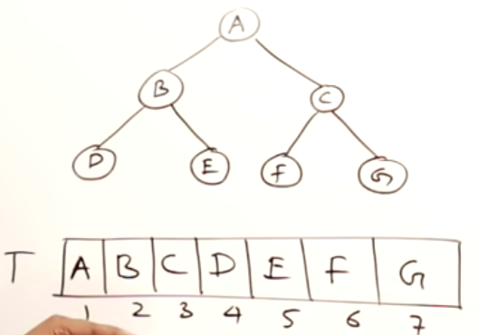
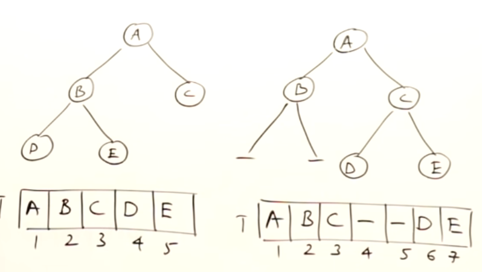
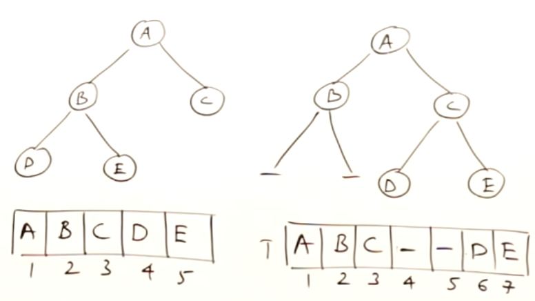
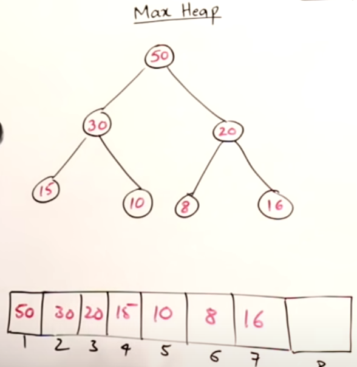
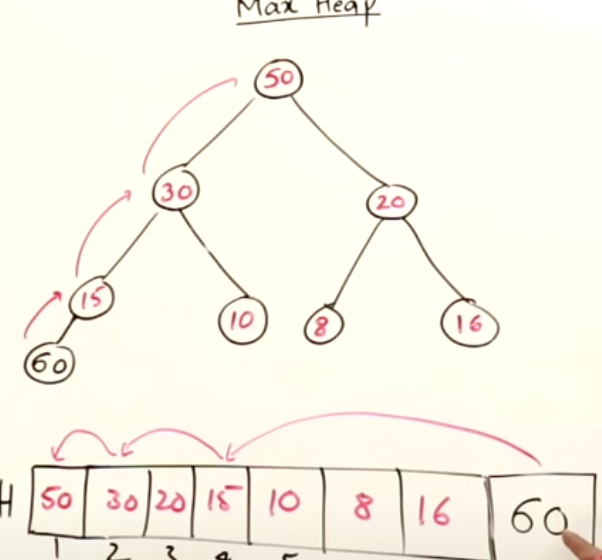
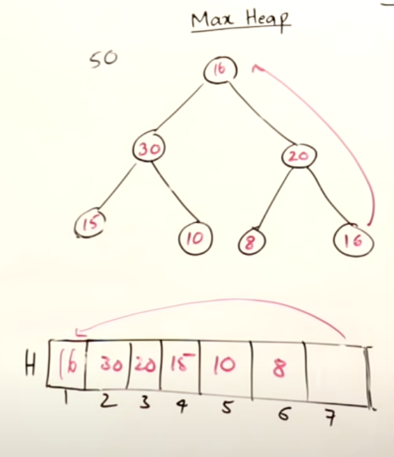
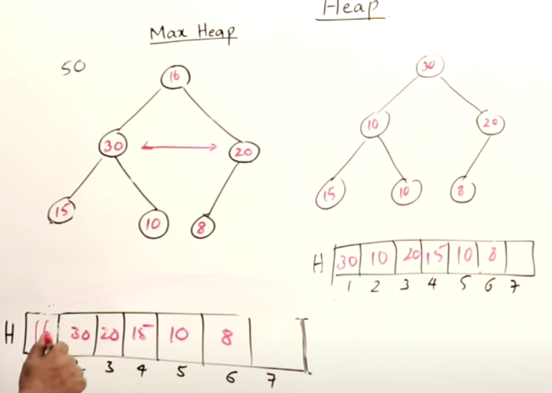
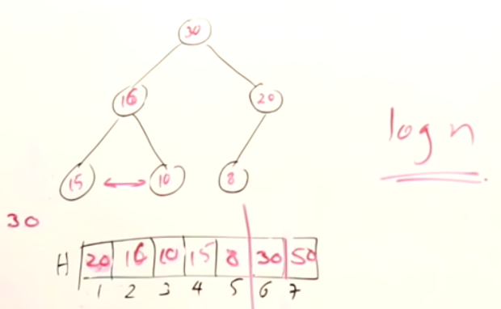
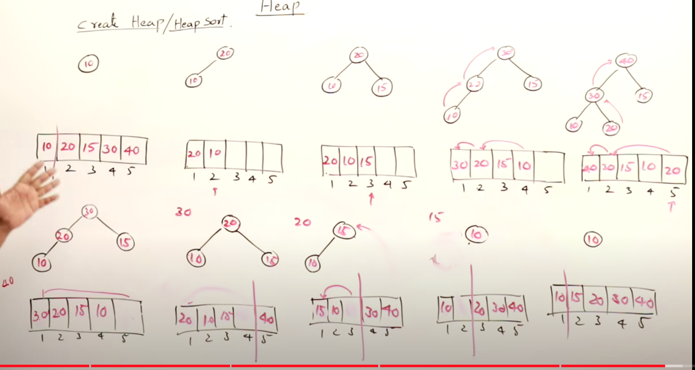

## Tree

- Linear data structures like as arrays, linked lists, queues and stack, data is ordered and you traverse them sequentially (pic: https://medium.com/basecs/how-to-not-be-stumped-by-trees-5f36208f68a7)
- Non-linear data structure can be trees and the data traversal is not sequential. Trees are made of nodes, links. A root, parent nodes, sibling nodes (the same parent), inner nodes, leaf nodes.
- **Depth** of a node: how many edges from the node to the root 
- **Height** of a node: the maximum path from the node to the furthest leaf node
- so the height of the root is the height of the tree.
- trees are recursive data structures, a tree has a nested subtrees.
- **balanced trees**: if any two **sibling subtree** do not differ in the height by more than one level.(otherwise it will be an unbalanced tree)
- filesystems are trees

## B-Tree
- B-tree generalized binary search tree, allowing nodes with more than two children
- Unlike self-balancing binary search trees, the B-tree is well suited for storage systems that read and write relatively large blocks of data, such as databases and filesystems.

## Binary Tree - Array Representation


- In array, the nodes are places level by level
- The relationship between nodes (left child, right child, parent) are formed by these statements (**also applied for BST**):
    - if a node is at index `i` (index starts as **1**):
    - its left child is at `2*i`
    - its right child is at `2*i + 1`
    - its parent is at `i // 2`

- if a node is at index `i` (index starts as **0**):
    - its left child is at `2*i + 1`
    - its right child is at `2*i + 2`
    - its parent is at `(i - 1) // 2`

- so based on those relationships we can find the left child, right child and a parent of a node with a given index in that array.
- When filling the array for that BT, BST, we need to put a blank if the child does not exist (`null`)




### Full Binary Tree
- At its height, it has max number of nodes. If we add a new node, we increase the height of the tree and add a new level.
- If the height of the binary tree is `h` (**height is 0 at root**), the number of nodes in full binary tree are: `2^(h+1) - 1`.
    - if height starts from **1**: `2^(h) - 1`

### Complete Binary Tree
- From looking at the array of the BT, we don't see any missing elements:

- A complete binary tree of height `h` is a full BT up to height `h - 1` and in the last level, elements are filled from left to right.
- **Height of a binary tree is minimu and is: `h = log n`. Because we don't go to the next level unless that level is full**

## Heap
- **Heap is a complete BT**.
- It's height is `h = log n`
- Max heap: every node has value greater than its descendents.

**Insert in Max Heap**



- we insert elements at the last free space available (not in the root) as leaf. filling from left to right at the leaf nodes. After insertion we need to sort the tree so it will be max heap again (every node value is higher than its descendant nodes):
    - compare the added node to its parent and if it's larger, it will be swapped by its parent. The node will be compared against its anscestors and will reach its right place.
    - **Insertion into heap time complexity**: the amount of time to do the swaps. How many swaps? **The height of the BT: O(log n)**
    - insert element to heap moves upward.




**Delete in Max Heap**
- like an arrangement of apples in a pyramid, we remove elements from the top.
- when the top is removed the last element in the BT should take its place.
- to adjust it to a max heap, from root to leaf, we compare the parent node to its children and swap till the node find its right place
- **Deleting an element in heap time complexity**: the amount of time to do the swaps. How many swaps? **The height of the BT: O(log n)**
    - delete element in heap moves upward.

 
 

- if we start adding the deleted elements to available space in the array (outside of heap), we get sorted values: heap sort


## Heap Sort
- when deleting from a heap, if we keep the deleted elements in the heap array at the available space (at the end but out of the heap), we get sorted next max element: we get heap sort.

- Heap sort has two steps:
1. for a set of elements, create a heap by inserting elements one by one.
2. once the heap is formed, delete all elements from the heap one by one. we get the sorted elements: Heap sort. 

- **Time complexity of creating a heap: O(n log n)**
- **Time complexity of deleting elements: O(n log n)**



## Heapify
- We see how to create a heap by inserting elements at leaf and adjusting upwards from leaf to root.
- Another way of creating a heap is heapify but the direction is downward. We have a tree and its array and we need to heapify that tree:
 - start from the last (leaf) nodes and look downwards towards the descendants. The leaf node themselves are heap.
 - in the array go from last to first and for each element, compare it against its descendant nodes and swap them if needed and once adjusted, compare that again with its descendatns and do it recursively all the way to the leaf. Once it is over, go to the next node in the array and repeat.
 - Time complexity: `O(n)`. **Creating a heap is `O(n log n) while heapify is faster: `O(n)`**


## Binary Search Tree (BST)
1. BST, every parent node can only have two possible child nodes and not more than that
2. so the root node points to two subtrees, left subtree and right subtree and this recursively is true for each subtrees that are binary trees and two subtrees...
3. **Not only the right child should be larger than the node but all the elements in the right subtree. Similarly, not only the left child should be less than the node but all the elements in the left subtree.**
4. the searchable part of the BST is that all the subtrees to the left a node are smaller than the value of that node and all the subtrees to the right of that node are larger in value than the value of that node.
- like the indexing databases are BST. or **git bisect** to find where the bad commit happens uses BST.
- BST are fast in insertion and lookup - **average case** a BST algorithm can insert or locate a node in a n-node BST in log2(N). The worst case can be slower based on the shapre of the tree (skewed)
- Always checkout the base/edge cases: empty tree (Null) and one node, two nodes and very skewed trees
- **Which one uses less memory in BST? DFS or BFS?**
- In terms of memory usage, Depth-First Search (DFS) generally uses less memory compared to Breadth-First Search (BFS) for traversing a tree or a graph. This is because DFS explores as far as possible along a branch before backtracking, which means it only needs to keep track of the nodes along the current branch using a stack. On the other hand, BFS explores all the neighbors of a node before moving on to their children, requiring a queue to keep track of nodes at the current level.
- **DFS**
    - DFS uses a stack to keep track of nodes in the current branch being explored. In the worst case, the stack depth can be equal to the height of the tree (in a binary tree, this is O(log N) for a balanced tree, and up to O(N) for an unbalanced tree).
    - The memory required for the stack is proportional to the depth of the recursion, which is less than the total number of nodes in the tree.
 
- **BFS**
  - BFS uses a queue to keep track of nodes at the current level. In the worst case, the queue can hold all the nodes at the current level, and in the case of a binary tree, the maximum number of nodes at a particular level in a binary tree: 2^(level). The hth level (h: height of the tree): 2^(h-1) nodes.
  
- **4. Inorder tranversal of BST is an array sorted in ascending order**
```py
def inorder(root):
    if root is None:
        return []
    return inorder(root.left) + [root.val] + inorder(root.right)
```


**5. Successor = "after node", i.e., the next node, or the smallest node after the current node**
- It's also the next node in the inoerder tranversal
```py
def successor(root: TreeNode) -> TreeNode:
    root = root.right
    while root.left:
        root = root.left
    return root
```

**6. Predecessor = "before node", i.e. the previous node, or the largest node before the current node**
- It's also the previous node in the inorder tranversal
```py
def predecessor(root: TreeNode) -> TreeNode:
    root = root.left
    while root.right:
        root = root.right
    return root
```


### Height-balanced Binary Tree
[**Drill Down With Recursion And Respond Back Up**](https://www.youtube.com/watch?v=LU4fGD-fgJQ) : 

- We can notice that we don't need to know the heights of all of the subtrees all at once. All we need to know is whether a subtree is height balanced or not and the height of the tree rooted at that node, not information about any of its descendants. **Our base case is that a null node (we went past the leaves in our recursion) is height balanced and has a height of -1 since it is an empty tree (under the sea)**. So the key is that we will drive towards our base case of the null leaf descendant and deduce and check heights on the way upwards.

- **Key points of interest:**
  1. Is the subtree height balanced?
  2. What is the height of the tree rooted at that node?

**Complexities**

**Time: O( n )**
- This is a postorder traversal (left right node) with possible early termination if any left subtree turns out unbalanced and an early result bubbles back up.
At worst we will still touch all n nodes if we have no early termination.

**Space: O( h )**
- Our call stack (from recursion) will only go as far deep as the height of the tree, so h (the height of the tree) is our space bound for the amount of call stack frames that we will create.

1. Example 1: check if the tree is height-balanced:
```py
class TreeNode(object):
    def __init__(self, val):
        self.val = val
        self.left = None
        self.right = None

root = [1,2,2,3,3,None,None,4,4]
root = TreeNode(1)
root.left = TreeNode(2)
root.right = TreeNode(3)
root.left.left = TreeNode(4)
root.left.right = TreeNode(5)
root.left.left.left = TreeNode(6)
root.left.left.right = TreeNode(7)

def isBalanced(node):
    if node is None:
        return (-1, True)
    
    leftHeight, isLeftSubtreeBalanced = isBalanced(node.left)
    rightHeight, isRightSubtreeBalanced = isBalanced(node.right)
    height = max(leftHeight, rightHeight) + 1
    isSubtreeBalanced = isLeftSubtreeBalanced and isRightSubtreeBalanced and abs(leftHeight - rightHeight) <= 1
    print('For Node:{} height:{} and balanced: {}'.format(node.val, height, isSubtreeBalanced))
    return (height, isSubtreeBalanced)
    
print(isBalanced(root))
```
### Traverse a Tree 

**1. Pre-order Tree Traversal**: Pre-order traversal is to visit the root first. Then traverse the left subtree. Finally, traverse the right subtree.
**In iterative method, we want to make sure that the left node is popped before the right node**:

```py
class TreeNode(object):
  def __init__(self, val):
      self.val = val
      self.left = None
      self.right = None

# Recursive
def preorder(root):
  return helper(root, result=[])

def _helper(self, node, result):
        if node:
            result.append(node.val)
            self._helper(node.left, result)
            self._helper(node.right, result)
            
        return result
  
def helper2(root, result):
  if root == None: 
     return result
     
  result.append(root.val)
  helper(root.left, result)
  helper(root.right, result)
  return result
  
# Iterative
def preorder(root):
  result = []
  if root == None: return result
  
  stack = [root]
  
  while stack:
    node = stack.pop()
    result.append(node.val)
    
    if node.right: stack.append(node.right)
    if node.left: stack.append(node.left)
    
  return result
```

**2. In-order Traversal**: In-order traversal is to traverse the left subtree first. Then visit the root. Finally, traverse the right subtree. Typically, **for binary search tree, we can retrieve all the data in sorted order using in-order traversal.**
```py
# recursive
def inorder(root):
  return helper(root, result=[])
  
def helper(root, result):
  if root == None: 
    return result
    
  helper(root.left, result)
  result.append(root.val)
  helper(root.right, result)
  
  return result
  
# iterative
def inorder(root):
  result = []
  if root == None: return result
  
  stack = []
  
  while True:
    while root:
      stack.append(root)
      root = root.left
      
    if len(stack) == 0:
      return result
      
    node = stack.pop()
    result.append(node.val)
    root = node.right
```

**3. Post-order Traversal**: Post-order traversal is to traverse the left subtree first. Then traverse the right subtree. Finally, visit the root. It is worth noting that **when you delete nodes in a tree, deletion process will be in post-order. That is to say, when you delete a node, you will delete its left child and its right child before you delete the node itself.**

Also, **post-order is widely use in mathematical expression. It is easier to write a program to parse a post-order expression. you can easily handle the expression using a stack. Each time when you meet a operator, you can just pop 2 elements from the stack, calculate the result and push the result back into the stack.**

```py
# Iterative
def postorder(root):
  result = []
  if root == None: return result
  
  stack = []
  visited = set()
  
  while True:
    while root:
      stack.append(root)
      root = root.left

    if not stack: return result
    node = stack[-1]

    if node.right and node not in visited:
      visited.add(node)
      root = node.right
    else:
      node2 = stack.pop()
      result.append(node2.val)
    
```

### Solve Tree problems recursively
- **Top-dowm solution**: "Top-down" means that in each recursive call, we will visit the node first to come up with some values, and pass these values to its children when calling the function recursively. So **the "top-down" solution can be considered as a kind of preorder traversal. To be specific, the recursive function top_down(root, params)**.
- **"Bottom-up"** is another recursive solution. In each recursive call, we will firstly call the function recursively for all the children nodes and then come up with the answer according to the returned values and the value of the current node itself. This process can be regarded as a kind of postorder traversal. 
- When you meet a tree problem, ask yourself two questions: Can you determine some parameters to help the node know its answer? Can you use these parameters and the value of the node itself to determine what should be the parameters passed to its children? If the answers are both yes, try to solve this problem using a **"top-down" recursive solution.**
- Or, you can think of the problem in this way: for a node in a tree, if you know the answer of its children, can you calculate the answer of that node? If the answer is yes, solving the problem recursively using a **bottom up** approach might be a good idea.
- **Bottom-up approach to find the max depth of a binary tree**:
```py
class TreeNode(object):
  def __init__(self, val):
      self.val = val
      self.left = left
      self.right = right

def maxDepth(root):
  if root == None:
      return 0
      
  left-depth = maxDepth(root.left)
  right-depth = maxDepth(root.right)
  depth = max(left-depth, right-depth) + 1
  
  return depth
```

- **Top-down approach:**
```py
def maxDepth(root):
  if root == None:
    return 0
    
  self.answer = 0
  def probe(node, depth):
    # leaf node
    if node.left == None and node.right == None
        self.answer = max(self.answer, depth + 1)
    if node.left: probe(node.left, depth + 1)
    if node.right: probe(node.right, depth + 1)  
  
  probe(root, 0)
  return self.answer
```

### Symmetric Tree
- Two trees are a mirror reflection of each other if:

1. Their two roots have the same value.
2. The right subtree of each tree is a mirror reflection of the left subtree of the other tree.

**The Recursive Complexity Analysis:**

- *Time complexity* : O(n). Because we traverse the entire input tree once, the total run time is O(n), where nn is the total number of nodes in the tree.

- *Space complexity* : **The number of recursive calls is bound by the height of the tree**. In the worst case, the tree is linear and the height is in O(n)O(n). Therefore, space complexity due to recursive calls on the stack is O(n)O(n) in the worst case.

** The Iterative Complexity**
- *Time complexity* : O(n). Because we traverse the entire input tree once, the total run time is O(n)O(n), where nn is the total number of nodes in the tree.

- *Space complexity* : There is additional space required for the search queue. In the worst case, we have to insert O(n) nodes in the queue. Therefore, space complexity is O(n).

- For iterative call, we use BFS & queue and compare two adjacent nodes to see if the symmtric condition holds. At the beginning, we need to push root node twice to pass the comparison in the loop.

### Populating Next Right Pointers in Each Node (Leetcode)
- Since we are manipulating tree nodes on the same level, it's easy to come up with
a very standard BFS solution using queue. But because of next pointer, we actually
don't need a queue to store the order of tree nodes at each level, we just use a next
pointer like it's a link list at each level; In addition, we can borrow the idea used in
the Binary Tree level order traversal problem, which use cur and next pointer to store
first node at each level; we exchange cur and next every time when cur is the last node
at each level.

- https://leetcode.com/explore/learn/card/data-structure-tree/133/conclusion/1016/:
- when we're given a tree with tree nodes having `.next`, It's a BFS traversal. now pointer is the current level traveler and head is the left most element at next level and the tail is the right most element at next level till now. We move now pointer at current level and populate the the next-link at its children level.

```py
def connect(self, root):
        """
        :type root: Node
        :rtype: Node
        """
        curr = root
        head = tail = None
        
        while curr:
            if curr.left:
                if tail:
                    tail.next = curr.left
                    tail = tail.next
                else:
                    head = tail = curr.left
            if curr.right:
                if tail:
                    tail.next = curr.right
                    tail = tail.next
                else:
                    head = tail = curr.right

            if not curr.next:
                curr = head
                head = tail = None
            else:
                curr = curr.next
        return root
   ```
### Lowest common ancestor
https://www.youtube.com/watch?v=13m9ZCB8gjw
https://www.youtube.com/watch?v=py3R23aAPCA
- In recursion problems in trees, always think about a node, what the node should be and should return from its left subtree and right subtree.

### Search in a Binary Search Tree
- remember the property of a binary search tree that at each node, the left subtree values are less than the parent node and the right subtree values are larger than the parent node. So if we try to find a value in a binary search tree, we can use this property to reduce the search. In the recursion approach: **Time and space complexity: O(h) the height of the tree**.
- https://leetcode.com/problems/search-in-a-binary-search-tree/
```py
def __init__(self):
    self.result = None
        
def searchBST(self, root, val):
    """
    :type root: TreeNode
    :type val: int
    :rtype: TreeNode
    """
    # Binary search tree has the property that left nodes are less and right nodes are larger than the root

    self.helper(root, val)
    return self.result

def helper(self, root, val):
    if root == None or root.val == val:
        self.result = root
        return root

    if root.val < val:
        return self.helper(root.right, val)
    else:
        return self.helper(root.left, val)
```

### Unique binary search trees
- Given an integer n, return all the structurally unique BST's (binary search trees), which has exactly n nodes of unique values from 1 to n. Return the answer in any order.

- great explanation:https://leetcode.com/problems/unique-binary-search-trees-ii/discuss/929000/Recursive-solution-long-explanation
```py
def generateTrees(self, n):
    """
    :type n: int
    :rtype: List[TreeNode]
    """
    if n==1:
        return [TreeNode(n)]

    return self.helper(1, n)
            
def helper(self, start, end):
    if start > end: # edge case, see exposition below
        return [None] 

    all_trees = [] # list of all unique BSTs
    for curRootVal in range(start, end+1): # generate all roots using list [start, end]
  # recursively get list of subtrees less than curRoot (a BST must have left subtrees less than the root)
        all_left_subtrees = self.helper(start, curRootVal-1)

  # recursively get list of subtrees greater than curRoot (a BST must have right subtrees greater than the root)
        all_right_subtrees = self.helper(curRootVal+1, end) 

        for left_subtree in all_left_subtrees:   # get each possible left subtree
            for right_subtree in all_right_subtrees: # get each possible right subtree
                # create root node with each combination of left and right subtrees
                curRoot = TreeNode(curRootVal) 
                curRoot.left = left_subtree
                curRoot.right = right_subtree

      # curRoot is now the root of a BST
                all_trees.append(curRoot)

    return all_trees

 ```

### Kth Smallest Element in BST
- https://leetcode.com/problems/kth-smallest-element-in-a-bst/
```py
# Definition for a binary tree node.
# class TreeNode:
#     def __init__(self, val=0, left=None, right=None):
#         self.val = val
#         self.left = left
#         self.right = right
class Solution:
    def kthSmallest(self, root: Optional[TreeNode], k: int) -> int:
        if root is None or k is None:
            return None

        count = 0
        stack = [root]
        visited = set()

        while stack:
            curr = stack.pop()

            if curr in visited:
                k -= 1
                if k == 0:
                    return curr.val

            else:
                visited.add(curr)
                if curr.right:
                    stack.append(curr.right)
                stack.append(curr)
                if curr.left:
                    stack.append(curr.left)

        if count < key:
            return None
```
### Minimum Distance between Nodes
- https://leetcode.com/problems/minimum-distance-between-bst-nodes
```py
# In-order traversal give an array in ascending order
# Definition for a binary tree node.
# class TreeNode:
#     def __init__(self, val=0, left=None, right=None):
#         self.val = val
#         self.left = left
#         self.right = right
class Solution:
    def minDiffInBST(self, root: Optional[TreeNode]) -> int:
        if root is None:
            return root

        stack = [root]
        visited = set()
        # result = []
        prev = None
        minDiff = float('Inf')

        while stack:
            curr = stack.pop()
            if curr in visited:
                # result.append(curr.val)
                if prev != None:
                    minDiff = min(minDiff, abs(curr.val - prev))
                    prev = curr.val
                else:
                    prev = curr.val
            else:
                visited.add(curr)
                if curr.right:
                    stack.append(curr.right)
                stack.append(curr)
                if curr.left:
                    stack.append(curr.left)

        # print(result)
        return minDiff
```

### Valid BST
- https://leetcode.com/problems/validate-binary-search-tree/description/
- Every children in the left subtree should also be less than the node and every children in the right subtree should be larger than the node **not only the left child and right child compared to the node**

```py
# Definition for a binary tree node.
# class TreeNode:
#     def __init__(self, val=0, left=None, right=None):
#         self.val = val
#         self.left = left
#         self.right = right
class Solution:
    def isValidBST(self, root: Optional[TreeNode]) -> bool:
        if root is None:
            return True

        # return self.helperRecursion(root, -float('Inf'), float('Inf'))
        return self.helperIterative(root)
        

    def helperRecursion(self, node, lowerLimit, upperLimit):
        if node is None:
            return True

        if node.val <= lowerLimit or node.val >= upperLimit:
            return False

        return self.helperRecursion(node.left, lowerLimit, node.val) and self.helperRecursion(node.right, node.val, upperLimit)


    def helperIterative(self, node):
        if node is None:
            return True

        stack = [(node, -float('Inf'), float('Inf'))]
        visited = set()

        while stack:
            curr, lowerLimit, upperLimit = stack.pop()
            if curr in visited:
                continue

            visited.add(curr)

            if curr.val <= lowerLimit or curr.val >= upperLimit:
                return False

            if curr.left:
                stack.append((curr.left, lowerLimit, curr.val))
            
            if curr.right:
                stack.append((curr.right, curr.val, upperLimit))

        return True
```

## Trie
- Trie is a tree data structure used for storing collections of strings. If 2 strings have a common prefix then they will have a same ancestor in a trie.
- Used for prefix-based search and you can sort strings lexographically in a trie.
- Each trie node has two main components: a map and a boolean for end of word:
```py
TrieNode {
  map<key: character, value: TrieNode children>
  bool endOfWord
}
```
### Insertion:
- Start with a root node with an empty map and F bool. Go to the first char of a word:
1. is char is in map (as a key)? 
    - if Yes, jump to the next letter and a child of that node. 
    - if No, 
      - insert that char into the node
      - create a TrieNode with empty map and F (unless we're at the last char in word which is then T)
      - create a connection between the new node (as a child) and the current node
2. Move to the next char in word and move to the newly created TrieNode.
3. The time complexity for insertion: O(l*n) where l: average lenght of a word, n: number of words

### Search a word:
- There are 2 kinds of searching:
  - prefix-based search: we're checking if there is at least one word which start with a given prefix or not
  - whole word search: we're checking if the entire word exists in the trie or not.

### Delete
- There are 2 types of delete:
  - delete an entire word
  - delete alll the words start with the given prefix

- for the whole word deletion, if the end of the word (the next node with T) has children, we can't delete the terminating (endofword) node because then we loose another word, in that case we just set the boolean from T to F.(https://www.youtube.com/watch?v=AXjmTQ8LEoI&t=960s, min:13.02)
- If the endofword node does not have any children & it is empty, we can safely remove it. Then we can go up and delete the one before ( as long as it does not have any childre)

```py
class TrieNode(object):
    def __init__(self):
        self.children = dict()
        self.endOfWord = False
        
        
class Trie(object):
    def __init__(self):
        self.root = TrieNode()
        
        
    def insert(self, word):
        current = self.root
        for char in word:
            if char not in current.children.keys():
                node = TrieNode()
                current.children[char] = node
            else:
                node = current.children[char]
            current = node
        current.endOfWord = True
        
    # insert recursion
    def insertRecursive(self, word):
        return self.helper(word, self.root, 0)
        
    def helper(self, current, word, idx):
        if idx == len(word):
            current.endOfWord = True
            return
        
        char = word[idx]
        if char not in current.children.keys():
            node = TrieNode()
            current.children[char] = node
        else:
            node = current.children[char]
        self.insertRecursion(node, word, idx + 1)
    
    
    # search
    def search(self, word):
        current = self.root
        for char in word:
            if char not in current.children.keys():
                return False
            current = current.children[char]
        return current.endOfWord
        
    def startsWith(self, prefix):
        """
        Returns if there is any word in the trie that starts with the given prefix.
        :type prefix: str
        :rtype: bool
        """
        curr = self.root
        
        for char in prefix:
            if char not in curr.children.keys():
                return False
            
            curr = curr.children[char]
            
        return True
        
    # search recursive
    def searchRecursive(self, word):
        return self.helperSearch(word, self.root, 0)
    
    def helperSearch(self, word, current, idx):
        if idx == len(word):
            return current.endOfWord
            
        char = word[idx]
        
        if char not in current.children.keys():
            return False
        return self.helperSearch(word, current.children[char], idx + 1)
     
    # delete a word 
    def delete(self, word):
        return self.helperDelete(word, self.root, 0)
    
    def helperDelete(self, word, current, idx):
        if idx == len(word):
            # when end of word is reached only delete if current.endOfWord is true
            if not current.endOfWord:
                return False
            current.endOfWord = False
            # if current has no other mapping then return true
            return len(current.children) == 0
        
        char = word[idx]
        if char not in current.children.keys():
            return False
        
        node = current.children[char]
        shouldDeleteCurrentNode = self.helperDelete(word, node, idx + 1)
        
        # if true is returning then delete the mapping of character and trienode reference from map.
        if shouldDeleteCurrentNode:
            del current.children[char]
            # return true if no mappings are left in the map
            return len(current.children) == 0

        return False
        
        
s = Trie()
print(s)
s.insert('apple')
s.insert('apcd')
s.insert('lmn')
# s.insertRecursion(TrieNode(), 'apple', 0)
print(s.search('lmne'))
            
```
## Find Longest Common Prefix
- https://leetcode.com/problems/longest-common-prefix/


## Binary Tree Height, Depth, node indices based on depth

- **Height** is measured from a leaf node. Height of a node is the number of edges on the longest path from the node to a leaf. A leaf node has a height of 0.
- **Depth** is measured from the root node. Depth of a node is the number of edges from the node to the root. A root has a depth of 0.
- Full binary tree means each node has either 0 or 2 children.
- Complete binary tree means all the levels except the lowest one is filled and the lead nodes are filled from left to right. Some leaf nodes might not have a right sibling.
- Number of nodes in a full binary tree at depth `k` is: `2^k`.
- The first leaf node in a full binary tree with height `h` is: `2^h` and so its index is `2^h - 1`.
- Number of nodes in a full binary tree is at least: `2^h + 1` and at most `2^(h+1) - 1`. Where `h` is the height of the tree.
- The index of the **last non-leaf node** in a complete tree is `n/2 - 1` where `n` is the number of nodes in complete tree.
- In a complete/full tree for each non-leaf node with index `i`, the left and right children of the node has indices: `2*i + 1` and `2*i + 2`.    

## Heap data structure/ Binary Heap / Min-heap, Max-heap / Priority Queue
(https://www.programiz.com/dsa/heap-data-structure)
- Heap data structure is a complete binary tree that satisfies the heap property, where any given node is
  - always greater than its child node/s and the key of the root node is the largest among all other nodes. This property is also called max heap property.
  - always smaller than the child node/s and the key of the root node is the smallest among all other nodes. This property is also called min heap property.

### Heap Operations:
#### Heapify
- given a binary tree (array) we change it into a binary heap data structure. It is used to create a Min-Heap or Max-Heap. **Heapify a single node is O(log n) so time complexity to heapify the whole binary tree is O(nlog n).**
#### Insert an element into heap O(log n)
#### Delete an element from heap O(log n)
#### Peak (find max/min) - Extract min/max O(1)

### Heapify
- We build a heap from a binary tree in a bottom-top manner. The idea is to find the position of the last non-leaf node and perform the heapify operation of each non-leaf node in **reverse level order all the way to index 0**.
```py
def heapify(arr, size, i):
   largest = i
   left = 2 * i + 1
   right = 2 * i + 2
   
   if left < size and arr[left] > arr[i]:
      largest = left
      
   if right < size and arr[right] > arr[largest]:
      largest = right
      
   if largest != i:
      arr[i], arr[largest] = arr[largest], arr[i]
      heapify(arr, size, largest)
      
def buildHeap(arr):
   size = len(arr)
   lastNonLeafNode = size // 2 - 1
   
   for i in range(lastNonLeafNode, -1, -1):
       heapify(arr, size, i)
```

## 1. Merge Two Binary Trees
### Recursive approach
- We can traverse both the given trees in a preorder fashion. At every step, we check if the current node exists(isn't null) for both the trees. If so, we add the values in the current nodes of both the trees and update the value in the current node of the first tree to reflect this sum obtained. At every step, we also call the original function mergeTrees() with the left children and then with the right children of the current nodes of the two trees. If at any step, one of these children happens to be null, we return the child of the other tree(representing the corresponding child subtree) to be added as a child subtree to the calling parent node in the first tree. At the end, the first tree will represent the required resultant merged binary tree.
```py
# Definition for a binary tree node.
# class TreeNode:
#     def __init__(self, val=0, left=None, right=None):
#         self.val = val
#         self.left = left
#         self.right = right
class Solution:
    def mergeTrees(self, node1: Optional[TreeNode], node2: Optional[TreeNode]) -> Optional[TreeNode]:
        if node1 is None:
            return node2
        
        if node2 is None:
            return node1

        node1.left = self.mergeTrees(node1.left, node2.left)
        node1.right = self.mergeTrees(node1.right, node2.right)

        node1.val += node2.val
        
        return node1
```
**Time complexity**
- `O(m)`A total of mmm nodes need to be traversed. Here, `m` represents the minimum number of nodes from the two given trees.

**Space complexity**
- `O(m)` The depth of the recursion tree can go upto `m` in the case of a **skewed tree**. **In average case, depth will be `O(logm)`.**

### Iterative approach
- We use stack : we again traverse the two trees, but this time we make use of a stackstackstack to do so instead of making use of recursion. Each entry in the stackstackstack strores data in the form `[node_{tree1}, node_{tree2}]`.

We start off by pushing the root nodes of both the trees onto the `stack`. Then, at every step, we remove a node pair from the top of the stack. For every node pair removed, we add the values corresponding to the two nodes and update the value of the corresponding node in the first tree. Then, if the left child of the first tree exists, we push the left child(pair) of both the trees onto the stack. If the left child of the first tree doesn't exist, we append the left child(subtree) of the second tree to the current node of the first tree. We do the same for the right child pair as well.

```py
# Definition for a binary tree node.
# class TreeNode:
#     def __init__(self, val=0, left=None, right=None):
#         self.val = val
#         self.left = left
#         self.right = right
class Solution:
    def mergeTrees(self, node1: Optional[TreeNode], node2: Optional[TreeNode]) -> Optional[TreeNode]:

        stack = []
        if node1 is None:
            return node2

        stack.append((node1, node2))

        while stack:
            node = stack.pop()

            if node[0] is None or node[1] is None:
                continue
            

            node[0].val += node[1].val

            if node[0].left is None:
                node[0].left = node[1].left
            else:
                stack.append((node[0].left, node[1].left))

            if node[0].right is None:
                node[0].right = node[1].right
            else:
                stack.append((node[0].right, node[1].right))


        return node1
```
## 2. Trim a Binary Search Tree
- https://leetcode.com/problems/trim-a-binary-search-tree/description/
- when `node.val < low` we trim the whole left subtree (children) and when `node.val > high` we trim the whole right subtree.
```py
# Definition for a binary tree node.
# class TreeNode:
#     def __init__(self, val=0, left=None, right=None):
#         self.val = val
#         self.left = left
#         self.right = right
class Solution:
    def trimBST(self, root: Optional[TreeNode], low: int, high: int) -> Optional[TreeNode]:

        def trim(node):
            if not node:
                return None
            elif node.val > high:
                return trim(node.left)
            elif node.val < low:
                return trim(node.right)
            else:
                node.left = trim(node.left)
                node.right = trim(node.right)
                return node

        return trim(root)
```

**Time Complexity**
- `O(N)`: where `N` is the total number of nodes in the given tree. We visit each node at most once.
- 
**Space Complexity**
- `O(N)`: Even though we don't explicitly use any additional memory, the call stack of our recursion could be as large as the number of nodes in the worst case.


## 3. Preorder tranversal in N-ary tree
- https://leetcode.com/problems/n-ary-tree-preorder-traversal/editorial/

**Recursive solution**
```py
"""
# Definition for a Node.
class Node(object):
    def __init__(self, val=None, children=None):
        self.val = val
        self.children = children
"""
import collections
class Solution(object):

    def preorder(self, root):
        """
        :type root: Node
        :rtype: List[int]
        """
        return self.helper([root], result=[])
        
   def helper(self, node, result):
        size = len(node)
        
        for i in range(size):
            if node[i] == None:
                return result
        
            result.append(node[i].val)
            self.helper(node[i].children, result)
        return result
```

**Iterative solution**
```py
class Solution(object):

    def preorder(self, root):
        """
        :type root: Node
        :rtype: List[int]
        """
        if root is None:
            return []

        stack, result = [root], []

        while stack:
            node = stack.pop()
            result.append(node.val)
            if node.children:
                stack.extend(node.children[::-1])
        
        return result
```

## 4. Search a binary Tree
- https://leetcode.com/articles/search-in-a-bst/

**Recursive**
```py
class Solution:
    def searchBST(self, root: TreeNode, val: int) -> TreeNode:
        if root is None or val == root.val:
            return root
        
        return self.searchBST(root.left, val) if val < root.val \
            else self.searchBST(root.right, val)
```

**Iterative**
```py
# Definition for a binary tree node.
# class TreeNode:
#     def __init__(self, val=0, left=None, right=None):
#         self.val = val
#         self.left = left
#         self.right = right
class Solution:
    def searchBST(self, root: Optional[TreeNode], val: int) -> Optional[TreeNode]:
        if root is None:
            return

        stack = [root]

        while stack:
            curr = stack.pop()
            if curr.val == val:
                return curr
            if val > curr.val and curr.right:
                stack.append(curr.right)
            elif val < curr.val and curr.left:
                stack.append(curr.left)
        
        return
```

**Time Complexity**
- `O(H)` height of tree. That results in `O(log N)` in the average case and `O(N)` in the worst case where `N` is the number of nodes.
**Space Complexity**
- **Recursive** `O(H)` height of tree. That results in `O(log N)` in the average case and `O(N)` in the worst case where `N` is the number of nodes.
- **Iterative** `O(1)`

## 5. Insert to a Binary Tree
- https://leetcode.com/articles/insert-into-a-bst/

**Recursive**
```py
class TreeNode:
    def __init__(self, val=None):
        self.val = val
        self.left = None
        self.right = None
        
def insert(root, val):
    if root is None:
        return TreeNode(val)
    
    if val > root.val:
        root.right = insert(root.right, val)
    elif val < root.val:
        root.left = insert(root.left, val)
        
    return root
```

**Iterative**
```py
# Definition for a binary tree node.
# class TreeNode:
#     def __init__(self, val=0, left=None, right=None):
#         self.val = val
#         self.left = left
#         self.right = right
class Solution:
    def insertIntoBST(self, root: Optional[TreeNode], val: int) -> Optional[TreeNode]:
        if root is None:
            return TreeNode(val)

        curr = root
        while curr:
            if val > curr.val:
                if not curr.right:
                    curr.right = TreeNode(val)
                    return root
                else:
                    curr = curr.right
            else:
                if not curr.left:
                    curr.left = TreeNode(val)
                    return root
                else:
                    curr = curr.left
        
        return root
```

## 6. Delete from a Binary Tree
- https://leetcode.com/problems/delete-node-in-a-bst

There are three possible situations here :

1. Node is a leaf, and one could delete it straightforward : node = null.
2. Node is not a leaf and **has a right child**. Then the node could be replaced by its successor which is somewhere lower in the right subtree. Then one could proceed down recursively to delete the successor.

3. Node is not a leaf, has no right child and has a left child. That means that its successor is somewhere upper in the tree but we don't want to go back. Let's use the predecessor here which is somewhere lower in the left subtree. The node could be replaced by its predecessor and then one could proceed down recursively to delete the predecessor.


```py
class Solution:
    # One step right and then always left
    def successor(self, root: TreeNode) -> int:
            root = root.right
            while root.left:
                root = root.left
            return root.val
        
    # One step left and then always right
    def predecessor(self, root: TreeNode) -> int:
        root = root.left
        while root.right:
            root = root.right
        return root.val

    def deleteNode(self, root: TreeNode, key: int) -> TreeNode:
        if not root:
            return None

        # delete from the right subtree
        if key > root.val:
            root.right = self.deleteNode(root.right, key)
        # delete from the left subtree
        elif key < root.val:
            root.left = self.deleteNode(root.left, key)
        # delete the current node
        else:
            # the node is a leaf
            if not (root.left or root.right):
                root = None
            # the node is not a leaf and has a right child
            elif root.right:
                root.val = self.successor(root)
                root.right = self.deleteNode(root.right, root.val)
            # the node is not a leaf, has no right child, and has a left child    
            else:
                root.val = self.predecessor(root)
                root.left = self.deleteNode(root.left, root.val)
                        
        return root
```
**Time Complexity**
- `O(H)` height of the tree and on-average `O(log N)`
**Space Complexity**
- `O(H)` to keep the recursion stack, where H is a tree height. `H=logN` for the **balanced tree**.

